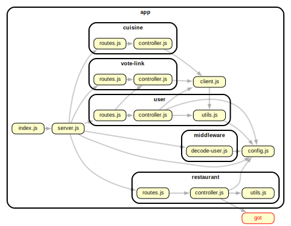

# Capstone Backend for Restaurant Voting

## Cuisines

```json
[
  {
    "name": "Afghan"
  },
  {
    "name": "African"
  },
  {
    "name": "American"
  },
  {
    "name": "Armenian"
  },
  {
    "name": "Asian"
  },
  {
    "name": "Australian"
  },
  {
    "name": "Bagels/Pretzels"
  },
  {
    "name": "Bakery"
  },
  {
    "name": "Bangladeshi"
  },
  {
    "name": "Barbecue"
  },
  {
    "name": "Bottled beverages, including water, sodas, juices, etc."
  },
  {
    "name": "Brazilian"
  },
  {
    "name": "Café/Coffee/Tea"
  },
  {
    "name": "Café/Coffee/Tea"
  },
  {
    "name": "Cajun"
  },
  {
    "name": "Californian"
  },
  {
    "name": "Caribbean"
  },
  {
    "name": "Chicken"
  },
  {
    "name": "Chilean"
  },
  {
    "name": "Chinese"
  },
  {
    "name": "Chinese/Cuban"
  },
  {
    "name": "Chinese/Japanese"
  },
  {
    "name": "Continental"
  },
  {
    "name": "Creole"
  },
  {
    "name": "Creole/Cajun"
  },
  {
    "name": "Czech"
  },
  {
    "name": "Delicatessen"
  },
  {
    "name": "Donuts"
  },
  {
    "name": "Eastern European"
  },
  {
    "name": "Egyptian"
  },
  {
    "name": "English"
  },
  {
    "name": "Ethiopian"
  },
  {
    "name": "Filipino"
  },
  {
    "name": "French"
  },
  {
    "name": "Fruits/Vegetables"
  },
  {
    "name": "German"
  },
  {
    "name": "Greek"
  },
  {
    "name": "Hamburgers"
  },
  {
    "name": "Hawaiian"
  },
  {
    "name": "Hotdogs"
  },
  {
    "name": "Hotdogs/Pretzels"
  },
  {
    "name": "Ice Cream, Gelato, Yogurt, Ices"
  },
  {
    "name": "Indian"
  },
  {
    "name": "Indonesian"
  },
  {
    "name": "Iranian"
  },
  {
    "name": "Irish"
  },
  {
    "name": "Italian"
  },
  {
    "name": "Japanese"
  },
  {
    "name": "Jewish/Kosher"
  },
  {
    "name": "Juice, Smoothies, Fruit Salads"
  },
  {
    "name": "Korean"
  },
  {
    "name": "Latin (Cuban, Dominican, Puerto Rican, South & Central American)"
  },
  {
    "name": "Mediterranean"
  },
  {
    "name": "Mexican"
  },
  {
    "name": "Middle Eastern"
  },
  {
    "name": "Moroccan"
  },
  {
    "name": "Not Listed/Not Applicable"
  },
  {
    "name": "Nuts/Confectionary"
  },
  {
    "name": "Other"
  },
  {
    "name": "Pakistani"
  },
  {
    "name": "Pancakes/Waffles"
  },
  {
    "name": "Peruvian"
  },
  {
    "name": "Pizza"
  },
  {
    "name": "Pizza/Italian"
  },
  {
    "name": "Polish"
  },
  {
    "name": "Polynesian"
  },
  {
    "name": "Portuguese"
  },
  {
    "name": "Russian"
  },
  {
    "name": "Salads"
  },
  {
    "name": "Sandwiches"
  },
  {
    "name": "Sandwiches/Salads/Mixed Buffet"
  },
  {
    "name": "Scandinavian"
  },
  {
    "name": "Seafood"
  },
  {
    "name": "Soul Food"
  },
  {
    "name": "Soups"
  },
  {
    "name": "Soups & Sandwiches"
  },
  {
    "name": "Southwestern"
  },
  {
    "name": "Spanish"
  },
  {
    "name": "Steak"
  },
  {
    "name": "Tapas"
  },
  {
    "name": "Tex-Mex"
  },
  {
    "name": "Thai"
  },
  {
    "name": "Turkish"
  },
  {
    "name": "Vegetarian"
  },
  {
    "name": "Vietnamese/Cambodian/Malaysia"
  }
]
```

## Vote Links

```json
[
  {
    "url": "ff2c5108-ddea-4b0f-bdda-d4cd6842d793",
    "votes": [
      {
        "cuisine": "Afghan",
        "count": 78
      },
      {
        "cuisine": "African",
        "count": 30
      },
      {
        "cuisine": "American",
        "count": 98
      },
      {
        "cuisine": "Armenian",
        "count": 84
      },
      {
        "cuisine": "Asian",
        "count": 73
      },
      {
        "cuisine": "Australian",
        "count": 61
      },
      {
        "cuisine": "Bagels/Pretzels",
        "count": 18
      },
      {
        "cuisine": "Bakery",
        "count": 5
      },
      {
        "cuisine": "Bangladeshi",
        "count": 90
      },
      {
        "cuisine": "Barbecue",
        "count": 50
      },
      {
        "cuisine": "Bottled beverages, including water, sodas, juices, etc.",
        "count": 56
      },
      {
        "cuisine": "Brazilian",
        "count": 80
      },
      {
        "cuisine": "Café/Coffee/Tea",
        "count": 71
      },
      {
        "cuisine": "Café/Coffee/Tea",
        "count": 18
      },
      {
        "cuisine": "Cajun",
        "count": 81
      },
      {
        "cuisine": "Californian",
        "count": 45
      },
      {
        "cuisine": "Caribbean",
        "count": 97
      },
      {
        "cuisine": "Chicken",
        "count": 60
      },
      {
        "cuisine": "Chilean",
        "count": 22
      },
      {
        "cuisine": "Chinese",
        "count": 92
      },
      {
        "cuisine": "Chinese/Cuban",
        "count": 92
      },
      {
        "cuisine": "Chinese/Japanese",
        "count": 16
      },
      {
        "cuisine": "Continental",
        "count": 15
      },
      {
        "cuisine": "Creole",
        "count": 100
      },
      {
        "cuisine": "Creole/Cajun",
        "count": 74
      },
      {
        "cuisine": "Czech",
        "count": 35
      },
      {
        "cuisine": "Delicatessen",
        "count": 56
      },
      {
        "cuisine": "Donuts",
        "count": 28
      },
      {
        "cuisine": "Eastern European",
        "count": 100
      },
      {
        "cuisine": "Egyptian",
        "count": 27
      },
      {
        "cuisine": "English",
        "count": 24
      },
      {
        "cuisine": "Ethiopian",
        "count": 48
      },
      {
        "cuisine": "Filipino",
        "count": 99
      },
      {
        "cuisine": "French",
        "count": 94
      },
      {
        "cuisine": "Fruits/Vegetables",
        "count": 80
      },
      {
        "cuisine": "German",
        "count": 0
      },
      {
        "cuisine": "Greek",
        "count": 14
      },
      {
        "cuisine": "Hamburgers",
        "count": 70
      },
      {
        "cuisine": "Hawaiian",
        "count": 77
      },
      {
        "cuisine": "Hotdogs",
        "count": 56
      },
      {
        "cuisine": "Hotdogs/Pretzels",
        "count": 85
      },
      {
        "cuisine": "Ice Cream, Gelato, Yogurt, Ices",
        "count": 14
      },
      {
        "cuisine": "Indian",
        "count": 86
      },
      {
        "cuisine": "Indonesian",
        "count": 38
      },
      {
        "cuisine": "Iranian",
        "count": 43
      },
      {
        "cuisine": "Irish",
        "count": 40
      },
      {
        "cuisine": "Italian",
        "count": 38
      },
      {
        "cuisine": "Japanese",
        "count": 72
      },
      {
        "cuisine": "Jewish/Kosher",
        "count": 86
      },
      {
        "cuisine": "Juice, Smoothies, Fruit Salads",
        "count": 64
      },
      {
        "cuisine": "Korean",
        "count": 0
      },
      {
        "cuisine": "Latin (Cuban, Dominican, Puerto Rican, South & Central American)",
        "count": 7
      },
      {
        "cuisine": "Mediterranean",
        "count": 99
      },
      {
        "cuisine": "Mexican",
        "count": 50
      },
      {
        "cuisine": "Middle Eastern",
        "count": 76
      },
      {
        "cuisine": "Moroccan",
        "count": 33
      },
      {
        "cuisine": "Not Listed/Not Applicable",
        "count": 90
      },
      {
        "cuisine": "Nuts/Confectionary",
        "count": 20
      },
      {
        "cuisine": "Other",
        "count": 10
      },
      {
        "cuisine": "Pakistani",
        "count": 9
      },
      {
        "cuisine": "Pancakes/Waffles",
        "count": 11
      },
      {
        "cuisine": "Peruvian",
        "count": 32
      },
      {
        "cuisine": "Pizza",
        "count": 17
      },
      {
        "cuisine": "Pizza/Italian",
        "count": 73
      },
      {
        "cuisine": "Polish",
        "count": 8
      },
      {
        "cuisine": "Polynesian",
        "count": 32
      },
      {
        "cuisine": "Portuguese",
        "count": 15
      },
      {
        "cuisine": "Russian",
        "count": 45
      },
      {
        "cuisine": "Salads",
        "count": 1
      },
      {
        "cuisine": "Sandwiches",
        "count": 96
      },
      {
        "cuisine": "Sandwiches/Salads/Mixed Buffet",
        "count": 29
      },
      {
        "cuisine": "Scandinavian",
        "count": 64
      },
      {
        "cuisine": "Seafood",
        "count": 39
      },
      {
        "cuisine": "Soul Food",
        "count": 1
      },
      {
        "cuisine": "Soups",
        "count": 9
      },
      {
        "cuisine": "Soups & Sandwiches",
        "count": 91
      },
      {
        "cuisine": "Southwestern",
        "count": 11
      },
      {
        "cuisine": "Spanish",
        "count": 73
      },
      {
        "cuisine": "Steak",
        "count": 12
      },
      {
        "cuisine": "Tapas",
        "count": 33
      },
      {
        "cuisine": "Tex-Mex",
        "count": 100
      },
      {
        "cuisine": "Thai",
        "count": 45
      },
      {
        "cuisine": "Turkish",
        "count": 74
      },
      {
        "cuisine": "Vegetarian",
        "count": 16
      },
      {
        "cuisine": "Vietnamese/Cambodian/Malaysia",
        "count": 70
      }
    ],
    "isActive": true,
    "admin_id": "5a9e1b5b9c8b2b0014a5d0d5"
  }
]
```

---


